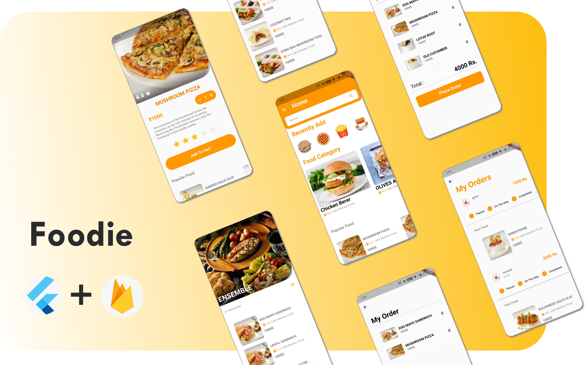

# Food Delivery App

 

This is a food ordering & delivery application built with a flutter framework and firebase real-time database. 
Anyone can use this code for their own purpose.

## Application features 

- Simple UI for food delivery app's

- Use SQLite to store order data in a local database 

- Used firebase real-time database for syncing data to server-side 

- Can add one or more food in the cart section 

- Automatically total bill will generate.

- Search different food/types

- View previous ordered food's from your account

- Google/mail auth login integrated 

### Home Screen & Category Screen
------

### Profile Screen
------

## Contributing 

Make Pull requests which improve the functionality of the application in any sorts. It should conform with the following conditions. 
* Clear , short , crisp description of the PR. 
* Should add on to the value of the application.

